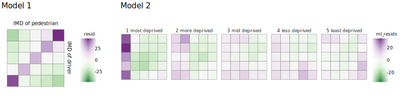

Data Analysis 1: Inequalities in pedestrian-driver-location
characteristics
================

## Introduction

This document describes the high-level data processing and analysis code
underpinning Data Analysis 1, which appears in section 5.1 of the full
paper.

Please cite:

Beecham, R. and Lovelace, R. *A framework for inserting
visually-supported inferences into geographical analysis workflow:
application to road crash analysis*. DOI: []().

## Setup

### Required libraries

If you do not have them, the required packages can be installed
individually with `install.packages(<package_name>)`. Core packages are
imported into the session with `library(<package_name>)`. Occasional use
of packages is made with the `<package-name>::<function-name>()` syntax
so as to avoid polluting the workspace.

``` r
pkgs <- c("tidyverse","sf", "here", "lme4")
# If not already installed.
# install.packages(pkgs)
# Core packages.
library(tidyverse)              # Bundle of packages for data manipulation. 
library(sf)                     # For working with geospatial data.
```

### ggplot themes and plot heper functions

I have created a `ggplot` theme for the plots in the paper and some
additional short helper functions. Load these into the environment using
the call to `source()` below.

``` r
# Load plot helper functions. 
source(here::here("R", "plot_helpers.R"))
```

## Download data

Load the pre-prepared crash data, described in
[`data-processing.md`](data-processing.md). Additionally, download
neighbourhood-level 2019 IMD classes from ONS’s [Open Geography
Portal](https://geoportal.statistics.gov.uk/).

``` r
# Crash data.
ped_veh <- fst::read_fst(here::here("data", "ped_veh.fst"))

# IMD data.
temp_url <- "https://opendata.arcgis.com/datasets/3db665d50b1441bc82bb1fee74ccc95a_0.csv"
imd <- read_csv(temp_url) 
```

## Data processing

Quintile positions are used for [2019
IMD](https://www.gov.uk/government/statistics/english-indices-of-deprivation-2019).
Whilst IMD is already recorded for pedestrians and drivers, for crash
locations, IMD class must be assigned by joining on the `imd` data on
the `LSOACD` variable.

``` r
# Identify quintile positions from IMD ranks.
imd <- imd %>% 
  mutate(
    quintile=ntile(IMD19,5),
    crash_quintile=case_when(
      quintile == 1 ~ "1 most deprived",
      quintile == 2 ~ "2 more deprived",
      quintile == 3 ~ "3 mid deprived",
      quintile == 4 ~ "4 less deprived",
      quintile == 5 ~ "5 least deprived"
    )
  )

# Recode pedestrian-driver IMD into quintiles.
ped_veh <- ped_veh %>%
  mutate(
    driver_imd_quintile=case_when(
      driver_imd_decile == "Most deprived 10%" ~ "1 most deprived",
      driver_imd_decile == "More deprived 10-20%" ~ "1 most deprived",
      driver_imd_decile == "More deprived 20-30%" ~ "2 more deprived",
      driver_imd_decile == "More deprived 30-40%" ~ "2 more deprived",
      driver_imd_decile == "More deprived 40-50%" ~ "3 mid deprived",
      driver_imd_decile == "Less deprived 40-50%" ~ "3 mid deprived",
      driver_imd_decile == "Less deprived 30-40%" ~ "4 less deprived",
      driver_imd_decile == "Less deprived 20-30%" ~ "4 less deprived",
      driver_imd_decile == "Less deprived 10-20%" ~ "5 least deprived",
      driver_imd_decile == "Least deprived 10%" ~ "5 least deprived",
      TRUE ~ driver_imd_decile),
    casualty_imd_quintile=case_when(
      casualty_imd_decile == "Most deprived 10%" ~ "1 most deprived",
      casualty_imd_decile == "More deprived 10-20%" ~ "1 most deprived",
      casualty_imd_decile == "More deprived 20-30%" ~ "2 more deprived",
      casualty_imd_decile == "More deprived 30-40%" ~ "2 more deprived",
      casualty_imd_decile == "More deprived 40-50%" ~ "3 mid deprived",
      casualty_imd_decile == "Less deprived 40-50%" ~ "3 mid deprived",
      casualty_imd_decile == "Less deprived 30-40%" ~ "4 less deprived",
      casualty_imd_decile == "Less deprived 20-30%" ~ "4 less deprived",
      casualty_imd_decile == "Less deprived 10-20%" ~ "5 least deprived",
      casualty_imd_decile == "Least deprived 10%" ~ "5 least deprived",
      TRUE ~ casualty_imd_decile)
  )
# Bring in IMD class of crash location.
ped_veh <- ped_veh %>%
  inner_join(imd %>% select(LSOA11CD, crash_quintile), by=c("lsoa_of_accident_location"="LSOA11CD"))
```

## Generate model data

Discussed in the paper are two models that were proposed through
visually exploring joint frequencies in the IMD characteristics of
pedestrian-drivers-crash-locations.

The first model is derived from a 5x5 contingency table of
pedestrian-driver characteristics (e.g. not including location). A
description of this appears in the paper, but expected values and
residuals assuming independence in pedestrian-driver crash frequencies
are generated from the row and column totals of the contingency table.

``` r
model_ped_veh <- ped_veh %>% 
  # Obs where the IMD class of pedestrian, driver and location is available.
  filter(
    !is.na(casualty_imd_decile), !is.na(driver_imd_decile),
    casualty_imd_decile!="Data missing or out of range", 
    driver_imd_decile!="Data missing or out of range", !is.na(crash_quintile)
    ) %>%
  # Record the grand_total: total pedestrian crashes. 
  mutate(grand_total=n()) %>% 
  # Record the row_total: total crashes for each IMD class of driver.
  group_by(driver_imd_quintile) %>% 
  mutate(row_total=n()) %>% ungroup %>%
  # Record the col_total: total crashes for each IMD class of pedestrian.
  group_by(casualty_imd_quintile) %>% 
  mutate(col_total=n()) %>% ungroup %>% 
  # Calculate over observed cells: each ped-driver IMD class combination.
  group_by(casualty_imd_quintile, driver_imd_quintile) %>% 
  summarise(
    # Observed crashes per ped-driver combination cell.
    observed=n(), 
    # row_total for that cell.
    row_total=first(row_total), 
    # col_total for that cell.
    col_total=first(col_total),
    grand_total=first(grand_total),
    # expected counts as per chi-square assumption of independence.
    expected=(row_total*col_total)/grand_total,
    # Residuals measure relative difference biased towards larger numbers 
    # due to sqrt() transformation in denominator.
    resid=(observed-expected)/sqrt(expected),
  ) %>% ungroup
```

The second model assumes that cell counts in a 5x5x5 contingency table —
of pedestrian-driver- *and* crash location — is a function of
“geodemographic distance”. Here, we treat the ordinal IMD class as a
continuous variable (taking values of 1-5) and calculate the euclidean
distance for pedestrian-driver-location corresponding to each position
of the 5x5x5 contingency table.

``` r
demog_distances <- 
  ped_veh %>%
  # Obs where the IMD class of pedestrian, driver and location is available.
  filter(
    !is.na(casualty_imd_decile), !is.na(driver_imd_decile),
    casualty_imd_decile!="Data missing or out of range",
    driver_imd_decile!="Data missing or out of range", !is.na(crash_quintile)
    ) %>%
  mutate(
    # Derive numeric values from IMD classes (ordered factor variable).
    across(
      c(casualty_imd_quintile, driver_imd_quintile, crash_quintile), 
      .fns=list(num=~as.numeric(factor(., levels=c(c("1 most deprived", "2 more deprived", "3 mid deprived", "4 less deprived", "5 least deprived")))))
    ),
    # Calculate demog_distance.
    demog_dist=sqrt(
      (casualty_imd_quintile_num-driver_imd_quintile_num)^2 +
      (casualty_imd_quintile_num-crash_quintile_num)^2 +
      (driver_imd_quintile_num-crash_quintile_num)^2
    )
  ) %>%
  # Calculate over observed cells: each ped-driver IMD class combination.
  group_by(casualty_imd_quintile, driver_imd_quintile, crash_quintile) %>%
  summarise(crash_count=n(), demog_dist=first(demog_dist)) %>%  ungroup() 

# Model crash count against demographic distance allowing the intercept to vary 
# on crash quintile. There may be some biasing in the distribution of counts due 
# to crash quintile (linked to systematic differences in rurality) and so we 
# want to observe the association net of this.
model <- lme4::glmer(crash_count ~ demog_dist + ( 1 | crash_quintile), 
                     data=demog_distances, family=poisson, nAGQ = 100)

# Extract model residuals.
demog_distances <- demog_distances %>% 
  mutate(ml_resids=residuals(model, type="pearson"))
```

## Plot model residuals



Below is code for plotting the residual values as a matrix — a sort of
visual contingency table. `geom_tile()` is used for cells of the matrix
and a diverging colour scheme for the signed residuals set to be centred
on 0 using `scale_fill_distiller()`.

``` r
# Model 1.
model_ped_veh %>%
  ggplot(aes(x=casualty_imd_quintile, y=driver_imd_quintile)) +
  geom_tile(aes(fill=resid), colour="#707070", size=.2) +
  # Make colour scale symmetrical on 0.
  scale_fill_distiller(
    palette="PRGn", direction=-1, 
    limits=c(-max(model_ped_veh$resid %>% abs()), max(model_ped_veh$resid %>% abs()))) +
  coord_equal() +
  theme_paper() 

# Model 2.
demog_distances %>%
  ggplot(aes(x=casualty_imd_quintile, y=driver_imd_quintile)) +
  geom_tile(aes(fill=ml_resids), colour="#707070", size=.2) +
  # Make colour scale symmetrical on 0.
  scale_fill_distiller(
    palette="PRGn", direction=-1,
    limits=c(-max(demog_distances$ml_resids %>% abs()), max(demog_distances$ml_resids) %>% abs())
  )+
  facet_wrap(~crash_quintile) +
  coord_equal() +
  theme_paper() 
```
