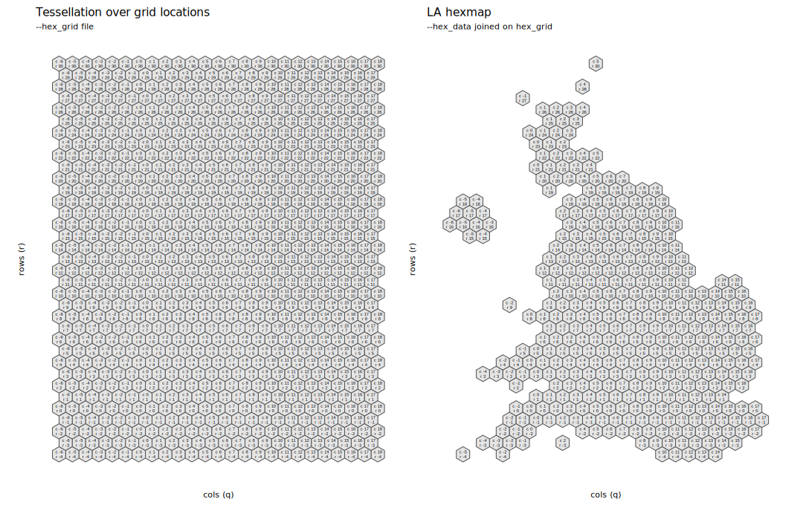

## Introduction

This document describes how the hexmap of Local Authority Districts used in Data Analysis 2 was generated. 

Please cite:

Beecham, R. and Lovelace, R. _A framework for inserting visually-supported inferences into geographical analysis workflow: application to road crash analysis_. DOI: []().

## Setup

### Required libraries 

If you do not have them, the required packages can be installed individually with `install.packages(<package_name>)`. Core packages are imported into the session with `library(<package_name>)`. Occasional use of packages is made with the `<package-name>::<function-name>()` syntax so as to avoid polluting the workspace.

```{r, load-packages, eval=FALSE}
pkgs <- c("tidyverse","sf","jsonlite", "here")
# If not already installed.
# install.packages(pkgs)
# Core packages
library(tidyverse)              # Bundle of packages for data manipulation. 
library(sf)                     # For working with geospatial data.
library(jsonlite)               # Reading in json. 
library(here)                   # For navigating project directory. 

```

### ggplot themes and plot heper functions

I have created a `ggplot` theme for the plots in the paper and some additional short helper functions. Load these into the environment using the call to `source()` below.

```{r, set-themes, eval=FALSE}
# Load plot helper functions. 
source(here::here("R", "plot_helpers.R"))
```


## ODI Leeds HexJSON

[ODI Leeds](https://github.com/odileeds) has generated hexmap layouts for various UK Geographies. These are published in their created [HexJSON](https://open-innovations.org/projects/hexmaps/hexjson) format. Here, each value of `hexes` is a geographic unit containing a `name`, column `q` and row `r` coordinated and `lat`, `lon` coordinates of the corresponding centroids.  

We downloaded the HexJSON file published for Local Authority Districts in GB, saved in [`/data/lad.hexjson`](/data/lad.hexjson). In this layout, odd numbered rows are shifted to the right (see [HexJSON](https://open-innovations.org/projects/hexmaps/hexjson)).

In the code below, we flatten out the `.hexjson` file and cast the `q`, `r` values as simple features point objects (`sfc_POINT`).

```{r, load-hexjson, eval=FALSE}
# ODI Hex layout for LADs
hex_data <- fromJSON(here("data", "lad.hexjson"))  %>% as_tibble() %>%
  dplyr::select(-layout) %>%  mutate(lad_code=names(hexes)) %>%
  mutate(col_names=map(hexes, ~names(.x)),
        col_values=map(hexes, ~unname(.x))) %>% dplyr::select(-c(hexes)) %>%
  unnest(c(col_names, col_values)) %>% 
  mutate(col_values=unlist(col_values)) %>% 
  pivot_wider(names_from=col_names, values_from=col_values) %>%  
  mutate(across(c(q,r), ~as.numeric(.x))) %>% 
  mutate(row=r, col=q) %>% 
  st_as_sf(coords = c("q","r")) 
```

## Tessellation grid on hex points

In the code below we generate a tessellation of hexagons according to the same width and height as the `lad.hexjson` file, stored as `sfc_POLYGON`.

```{r, tesselate-points, eval=FALSE}
# Dimensions of hexJSON file.
min_col <- min(hex_data$col) 
max_col <- max(hex_data$col)
width <- max_col-min_col

min_row <- min(hex_data$row) 
max_row <- max(hex_data$row) 
height <- max_row-min_row

# Hexagon tesselation over points. 
hex_grid <- 
  st_sf(
    geom=st_make_grid(hex_data, n=c(width,height), what="polygons", square=FALSE, flat_topped=FALSE, cellsize=1)
    ) %>% 
  mutate(id=row_number())

# Find centroids of hexagons.
hex_centroids <- hex_grid %>% st_centroid() %>% st_coordinates() %>% as_tibble() %>% 
  rename("east"="X", "north"="Y")

# Add centroid locations to hex_grid object.
hex_grid <- hex_grid %>% 
  add_column(hex_centroids %>% dplyr::select(east), u_centroids %>% dplyr::select(north))
```

## Look-up grid on ODI Leeds hexJSON



In order to generate the hexmap, we need to be able to join the hexJSON locations (`hex_data`) on the tessellated polygons (`hex_grid`). To do this we need the column and row references for `hex_grid` to match exactly those in `hex_data`.   

```{r, match-grid-map, eval=FALSE}
# Col positions. Find number of unique column positions. 
col_positions <- hex_grid %>% st_drop_geometry() %>%  mutate(east=round(east,1)) %>% pull(east) %>% unique() %>%  length()

# Row positions. Find number of unique row positions.   
row_positions <- hex_grid %>% st_drop_geometry() %>% pull(north) %>% unique() %>%  length()

# To match with hex_data rows must be integer positions.
hex_grid <- hex_grid %>%  
  mutate(
    north_recode=
           map_scale(dense_rank(north), 1, row_positions, min_row, min_row+row_positions-1))

# Note that height should be 34 when in fact 40. 
hex_grid %>% ggplot() + geom_sf() + 
  geom_text(aes(x=east, y=north+.15, label=round(east,1)), size=2) + 
  geom_text( aes(x=east, y=north-.15, label=paste("r", north_recode)), size=2)

# There are extra rows here to be removed -- and odd rows must have columns shifted to the right.
# Remove r-4 and r>31, then rescale between min_row and max_row.
hex_grid <- hex_grid %>% 
  filter(between(north_recode, -3, 31)) %>% 
  mutate(
    north_recode=
           round(map_scale(north_recode, -3, max_row+1, min_row, max_row),0)) 
# Now transform column references depending on whether on an even/odd row.
hex_grid <- hex_grid %>% 
  mutate(
    east_recode=if_else(north_recode %% 2==0, ceiling(east), round(east,0))) 

# And inner_join on hex_data in order to generate LA hexagon map.
hex_map <- hex_grid %>%  
  inner_join(hex_data %>% st_drop_geometry() %>% 
               dplyr::select(lad_code, col, row), by=c("east_recode"="col", "north_recode"="row"))
````


```{r, plot-grid-map, eval=FALSE, echo=FALSE}
plot_grid <- hex_grid %>% ggplot() + geom_sf() + coord_sf() +
  geom_text(aes(x=east, y=north+.18, label=paste("c", east_recode)), size=2) + 
  geom_text( aes(x=east, y=north-.18, label=paste("r", north_recode)), size=2) +
  labs(
    title="Tessellation over grid locations", 
    subtitle="--hex_grid file",
    x="cols (q)",
    y="rows (r)") +
  theme(axis.text = element_blank())

plot_map <- hex_map %>% ggplot() + geom_sf() + coord_sf() +
  geom_text(aes(x=east, y=north+.18, label=paste("c", east_recode)), size=2) + 
  geom_text( aes(x=east, y=north-.18, label=paste("r", north_recode)), size=2) +
  labs(
    title="LA hexmap", 
    subtitle="--hex_data joined on hex_grid",
    x="cols (q)",
    y="rows (r)") +
  theme(axis.text = element_blank())
  
plot <- plot_grid + plot_map
ggsave(here("img", "hexmap.svg"), plot, width=15, height=9.5)
````
