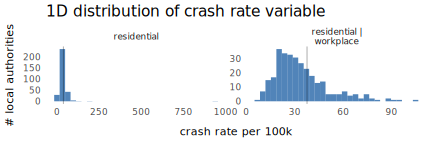
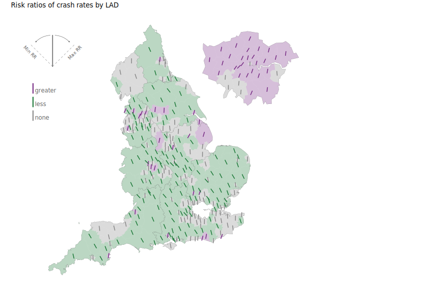
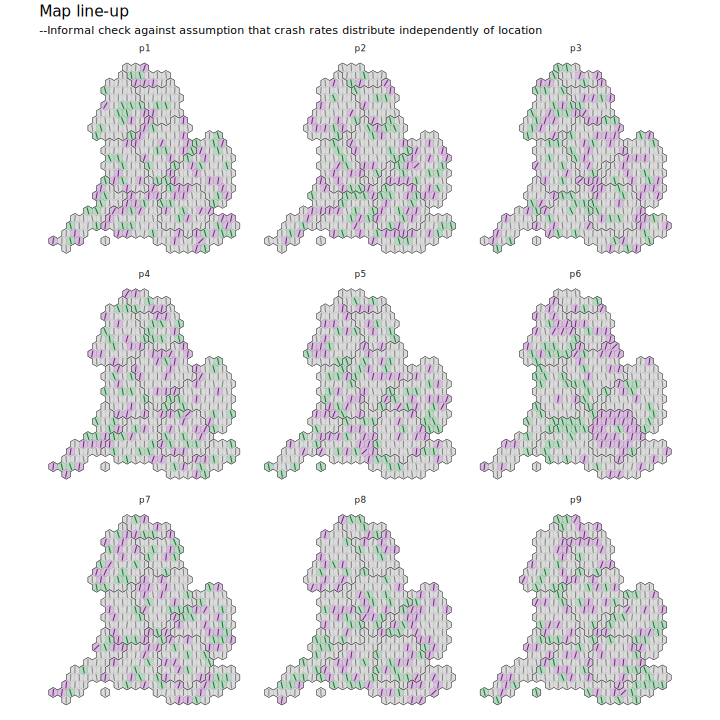

## Introduction

This document describes the high-level data processing and analysis code underpinning Data Analysis 2, which appears in section 5.2 of the full paper.

Please cite:

Beecham, R. and Lovelace, R. "A framework for inserting
visually-supported inferences into geographical analysis workflow:
application to road crash analysis", *Geographical Analysis*. DOI: [0.1111/gean.12338](https://doi.org/10.1111/gean.12338).


## Setup

### Required libraries

If you do not have them, the required packages can be installed individually with `install.packages(<package_name>)`. Core packages are imported into the session with `library(<package_name>)`. Occasional use of packages is made with the `<package-name>::<function-name>()` syntax so as to avoid polluting the workspace.


```{r, load-packages, eval=FALSE}
pkgs <- c("tidyverse","sf", "here", "lme4", "lubridate", "rsample", "ggdist", "distributional")
# If not already installed.
# install.packages(pkgs)
# Core packages.
library(tidyverse)              # Bundle of packages for data manipulation.
library(sf)                     # For working with geospatial data.
```


### ggplot themes and plot heper functions

I have created a `ggplot` theme for the plots in the paper and some additional short helper functions. Load these into the environment using the call to `source()` below.

```{r, set-themes, eval=FALSE}
# Load plot helper functions.
source(here::here("R", "plot_helpers.R"))
```


## Download data

In addition to the pre-prepared road crash data (see [`data-processing.md`](data-processing.md)), the analysis uses ONS [mid-year population estimates](https://www.ons.gov.uk/peoplepopulationandcommunity/populationandmigration/populationestimates) collected at Local Authority District level, 2011 Census estimates of [workday population](https://www.nomisweb.co.uk/sources/census_2011_wd) and 2019 Local Authority District (LAD) [boundary data](https://geoportal.statistics.gov.uk/datasets/local-authority-districts-december-2019-boundaries-uk-bgc/explore). I have placed these in the [`/data`](/data) folder.


```{r, download-data, eval=FALSE}
# Crash data.
ped_veh <- fst::read_fst(here::here("data", "ped_veh.fst"))
# LAD context.
# Boundary data simplified using mapshapr (https://github.com/mbloch/mapshaper).
lad <- st_read(here::here("data", "lad.geojson"))
```

Joining population data measured at the LAD level with STATS19 crash data was somewhat tedious. Although there is a `local_authority_district` variable in STATS19, many boundary changes to local authorities correctly recorded in ONS datasets were
not carried through to STATS19. Also, only text names of LADs are recorded in STATS19 and so minor differences in the way these are recorded undermines the matching process.

So we attempt a spatial join on the LAD boundary data in `lad.geojson`. To do this we cast point locations in `ped_veh` to OSGB Easting/Northing. Nineteen crash records, of which only four occur in 2019, do not have point locations recorded. Some records (c.800 of >250k) were not successfully matched through this spatial join, and for these we perform a textual match on the `local_authority_district` variable and finally manually recode any failed matches that were the result of boundary changes.

```{r, join-data, eval=FALSE}
ped_veh <- st_as_sf(
  x=ped_veh %>% filter(!is.na(location_easting_osgr)),
  coords=c("location_easting_osgr", "location_northing_osgr"),
  crs=27700
  )
# Spatial join on boundary data.
ped_veh <- st_join(ped_veh, lad %>% select(lad19cd)) %>% st_drop_geometry()
# Identify records to match on names -- e.g. those not successfully spatially joined.
lad_names_match <- ped_veh %>% filter(is.na(lad19cd)) %>%
  select(local_authority_district) %>% unique
# Inspect those boundary change LADs that can't be matched (e.g. NA on this text join).
lad_names_match %>%
  left_join(lad %>% st_drop_geometry(), by=c("local_authority_district"="lad19nm")) %>%
  View()

# Manually recode those not matching and join.
ped_veh <- ped_veh %>%
  left_join(lad  %>% st_drop_geometry() %>% select(lad_code=lad19cd, lad19nm),
            by=c("local_authority_district"="lad19nm")) %>%
  mutate(
    lad19cd=if_else(is.na(lad19cd), lad_code, lad19cd),
    match_failed=is.na(lad19cd),
    la_renamed=local_authority_district,
    local_authority_district=case_when(
      match_failed & la_renamed == "Suffolk Coastal" ~ "East Suffolk",
      match_failed & la_renamed == "Waveney" ~ "East Suffolk",
      match_failed & la_renamed =="Shepway" ~ "Folkestone and Hythe",
      match_failed & la_renamed =="West Somerset" ~ "Somerset West and Taunton",
      match_failed & la_renamed == "Poole" ~ "Bournemouth, Christchurch and Poole",
      match_failed & la_renamed == "West Dorset" ~ "Dorset",
      match_failed & la_renamed == "The Vale of Glamorgan" ~ "Vale of Glamorgan",
      match_failed & la_renamed == "Edinburgh, City of" ~	"City of Edinburgh",
      match_failed & la_renamed == "Purbeck" ~ "Dorset",
      match_failed & la_renamed == "Weymouth and Portland" ~ "Dorset",
    TRUE ~ "")
  ) %>%
  select(-lad_code) %>%
  left_join(lad %>% st_drop_geometry() %>% select(lad_code=lad19cd, lad19nm),
            by=c("local_authority_district"="lad19nm")) %>%
  mutate(lad19cd=if_else(is.na(lad19cd), lad_code, lad19cd)) %>%
  select(-c(lad_code, la_renamed)) %>%
  # Bring in correct names.
  left_join(lad %>% st_drop_geometry() %>% select(lad19cd, lad19nm)) %>%
  # Clean out non-England LADs.
  filter(str_detect(lad19cd,"^E0*"))
```


## Data processing

Our analysis explores estimated pedestrian crash rates for 2019. Below we calculate these rates for each LAD. During exploratory analysis, we identified a problem with a residential population denominator: it doesn't always capture "exposure" well, especially for dense urban LADs. Therefore we also bring in an estimate of the workday population in each LAD. This is available only for 2011 Census. In order to estimate this quantity for 2019, we make the assumption that workday populations grow at the same rate for each LAD as residential populations and increase/decrease estimated workday populations accordingly.

```{r, data-processing, eval=FALSE}
# Calculate LAD crash rates.
observed_rates <- ped_veh %>%
  mutate(year=lubridate::year(date)) %>%
  # Crashes occurring in 2019 only.
  filter(year==2019) %>%
  group_by(lad19cd) %>%
  summarise(crash_count=n()) %>%
  inner_join(lad %>% st_drop_geometry()) %>%
  mutate(
    growth=res_2019/res_2011,
    workday_2019=workday*growth,
    avg_pop=(workday_2019+res_2019)/2,
    # Crash rates exressed as counts per 100k population.
    crash_rate=crash_count/(res_2019/100000),
    crash_rate_adj=crash_count/(avg_pop/100000)
  )

# Calculate national average crash rate.
crash_nat <- observed_rates %>%
  summarise(crash_rate=sum(crash_count)/(sum(res_2019)/100000)) %>% pull(crash_rate)
crash_nat_adj <- observed_rates %>%
  summarise(crash_rate=sum(crash_count)/(sum(avg_pop)/100000)) %>% pull(crash_rate)
```




Below is code for plotting and comparing the 1D distribution of these rate variables with the two different denominators.

```{r, plot-rate, eval=FALSE}
observed_rates %>%
  pivot_longer(cols=c(crash_rate, crash_rate_adj)) %>%
  mutate(name=if_else(name=="crash_rate", "residential", "residential |\nworkplace ")) %>%
  ggplot() +
  geom_histogram(aes(value), fill="#08519c", alpha=.7) +
  geom_vline(aes(xintercept=37.6), alpha=.5, size=.3) +
  labs(x="crash rate per 100k", y="# local authorities", title="1D distribution of crash rate variable") +
  facet_wrap(~name, scales="free", nrow=1) +
  theme_paper()
```

## Ranking and comparing crash rates between LADs

Next we wish to compare LADs based on their crash rates with associated uncertainty information from an empirical sampling distribution. The code below generates this empirical sampling distribution, making crash rate estimates on each resample.

```{r, bootstrap-rate, eval=FALSE}
boots_lad <- ped_veh %>%
  mutate(year=lubridate::year(date)) %>%
  filter(year==2019) %>%
  # Select out LAD code as no other crash context required.
  select(lad19cd) %>%
  # Nesting to collapse data to a list-col.
  nest(data=c(lad19cd)) %>%
  # Resample observations from data contained in list-col with replacement, keep original data.
  mutate(la_boot = map(data, rsample::bootstraps, times=1000, apparent=TRUE)) %>%
  # Unnest to generate data frame of bootsrap IDs and associated data, stored in splits.
  select(-data) %>% unnest(la_boot) %>%
  # Map over splits and extract LAD code.
  mutate(
    lad19cd=map(splits, ~rsample::analysis(.) %>% pull(lad19cd))
  ) %>%
  # Unnest to data frame where each observation is a bootstrap ID and sampled LAD.
  select(-splits) %>% unnest(lad19cd) %>%
  # Summarise over bootstrap ID and LAD to generate sampling distribution of crash counts.
  group_by(id, lad19cd) %>%
  summarise(crash_count=n()) %>% ungroup %>%
  # Compute range in bootstrap sampling distribution for each LAD.
  group_by(lad19cd) %>%
  mutate(
    lower=quantile(crash_count,probs=.025, names=FALSE), upper=quantile(crash_count,probs=.975, names=FALSE)
    ) %>% ungroup %>%
  # Work on full/original dataset for re-computing estimated rates.
  filter(id=="Apparent")  %>%
  left_join(lad %>% st_drop_geometry()) %>%
  group_by(lad19cd) %>%
  mutate(
    growth=res_2019/res_2011,
    workday_2019=workday*growth,
    avg_pop=(workday_2019+res_2019)/2,
    crash_rate=crash_count/(avg_pop/100000),
    rr=crash_rate/crash_nat_adj,
    lower=lower/(avg_pop/100000),
    upper=upper/(avg_pop/100000),
    # Identify whether observed crash rate is different from national rate, given sampling distribution.
    is_sig=!between(1,lower/crash_nat_adj, upper/crash_nat_adj)
    ) %>% ungroup
```

We then represent these estimated crash rates for comparison as gradient plots, using [Matt Kay's](https://www.mjskay.com/) [`ggdist`](https://mjskay.github.io/ggdist/) package.


```{r, plot-bootstrap-rate, eval=FALSE}
boots_lad %>%
  top_n(25, crash_rate) %>%
  mutate(std.error=(upper-lower)/2) %>%
  ggplot(aes(x=reorder(lad19nm, crash_rate), y=crash_rate)) +
  stat_dist_gradientinterval(
    aes(dist=dist_normal(mu=crash_rate, sigma=std.error)),
    show_point=FALSE, show_interval=FALSE, fill="#08519c") +
  geom_spoke(angle=0, radius=.5, position="center_spoke",alpha=.3, size=.3, colour="#08519c") +
  geom_hline(yintercept=crash_nat_adj, size=.1, alpha=.5)+
  scale_y_continuous(limits=c(20,140), expand = c(0, 0)) +
  labs(y="crashes per 100k", x="local authority", subtitle="25 highest crash rates")+
  coord_flip()+
  theme_paper()
```

## Geographic variation in crash rates between LADs



In order to analyse geographic patterns in crashes, we represent crash rates as risk ratios comparing the observed crash rate in each LAD to a benchmark, the crash rate we would expect  see nationally. RRs are an intuitive measure of effect size: RRs >1 indicate that the crash rate is greater than the national average; RRs <1 that it is less than the national average. As they are a ratio of ratios, and therefore agnostic to sample size, RRs can nevertheless be unreliable. Two ratios might be compared that have very different sample sizes and no compensation is made for the one that contains more data. We know this to be a problem in our dataset and so we use the ranges in our empirical bootstrap to construct confidence intervals for the RRs.


```{r, conf-int, eval=FALSE}
# Specify RR confidence intervals for mappng.
rr_boots_lad <- boots_lad %>%
  mutate(
    rr=crash_rate/crash_nat,
    # Variable for colouring according to sig type.
    sig_type = case_when(
      !is_sig ~ "none",
      rr > 1 ~ "greater",
      rr < 1 ~ "less"
    ),
    is_greater = if_else(rr>1, "greater", "lesser")
  )
```

RRs for each LAD are represented with a "|" icon, positioned at LAD centroids. Icons are then encoded according RR values by continuously varying icon angles. They are additionally coloured according to whether RR ranges are different from expectation. A line primitive in `ggplot` (`geom_spoke()`) makes it straightforward to specify  these encodings declaratively (as below).


```{r, plot-rate-map, eval=FALSE}
# Bounds to pin oriented lines to.
max_rr <- max(rr_boots_lad %>% pull(rr), na.rm = TRUE)
min_rr <- min(rr_boots_lad %>% pull(rr), na.rm = TRUE)
# Define colours for encoding by sig type and direction.
colours_type <- c("#762a83","#1b7837", "#878787")
# Cast variable identifying sig type to factor.
rr_boots_lad <- rr_boots_lad %>%
  mutate(sig_type=factor(sig_type, levels=c("greater", "less", "none")))
names(colours_type) <- c("greater", "less", "none")

# Plot
lad %>%
  inner_join(rr_boots_lad) %>%
  ggplot()+
  # Colour LAD areas by sig_type (low opacity, so alphe=.3).
  geom_sf(data=. %>% filter(crash_rate!=0), aes(fill=sig_type, colour=sig_type),
          size=0.02, alpha=.3)+
  coord_sf(crs=27700, datum=NA)+
  # Draw RRs >1 and <1 sepaately.
  geom_spoke(
    data=. %>% filter(crash_rate!=0, rr>1),
    aes(x=east, y=north, angle=get_radians(map_scale(rr,1,max_rr,90,45)), colour=sig_type),
    radius=6500, position="center_spoke", size=.7
  )+
  # Less.
  geom_spoke(
    data=. %>% filter(crash_rate!=0, rr<1),
    aes(x=east, y=north, angle=get_radians(map_scale(rr,min_rr,1,135,90)), colour=sig_type),
    radius=6500, position="center_spoke", size=.7
  )+
  scale_fill_manual(values=colours_type)+
  scale_colour_manual(values=colours_type)+
  theme_paper()
```


In the paper we make the case for conditioning of crash rates on sample size more explicit/direct, via an adjustment similar to Empirical Bayes (e.g. [Devine et al. (1994)](https://journals.lww.com/epidem/pages/articleviewer.aspx?year=1994&issue=11000&article=00010&type=abstract)). We also add a fixed effect term on population density which serves as an umbrella variable for capturing systematic differences in context (see [Eksler et al. 2008](https://www.sciencedirect.com/science/article/abs/pii/S0033350607003307)). To do this, we specify a poisson regression model updated with a random effect on LAD and fixed effect on (log) population density. The model is created using the [`lme4`](https://cran.r-project.org/web/packages/lme4/index.html) package and we again run the model on a bootstrap sampling distribution to show variation in the estimated (Bayesian) Risk Ratios.

The code below again generates a bootstrap sampling distribution, stored in the `boots_lad` object. We then [`map()`](https://purrr.tidyverse.org/reference/map.html) over each resample to specify the regression models and `map()` over each model object to extract estimated RRs.

```{r, model-update, eval=FALSE}
boots_lad <- ped_veh %>%
  mutate(year=lubridate::year(date)) %>%
  filter(year==2019) %>%
  # Select out LAD code as no other crash context required.
  select(lad19cd) %>%
  # Nesting to collapse data to a list-col.
  nest(data=c(lad19cd)) %>%
  # Resample observations from this data frame with replacement, keep original data.
  mutate(la_boot = map(data, rsample::bootstraps, times=1000, apparent=TRUE)) %>%
  # Unnest to generate data frame of bootsrap IDs and associated data, stored in splits.
  select(-data) %>% unnest(la_boot) %>%
  # Map over splits and extract LAD code.
  mutate(
    lad19cd=map(splits, ~rsample::analysis(.) %>% pull(lad19cd))
  ) %>%
  # Unnest to data frame where each observation is a bootstrap ID and sampled LAD.
  select(-splits) %>% unnest(lad19cd) %>%
  # Summarise over bootstrap ID and LAD to generate sampling distribution of crash counts.
  group_by(id, lad19cd) %>%
  summarise(crash_count=n()) %>% ungroup %>%
  left_join(lad %>%
              mutate(
                growth=res_2019/res_2011,
                workday_2019=workday*growth,
                avg_pop=(workday_2019+res_2019)/2,
                pop_dens=log(avg_pop/st_areashape),
                log_pop=log(avg_pop)
                )
  )

boots_lad <- boots_lad %>%
  nest(data=-id) %>%
  mutate(
    model = map(data, ~lme4::glmer(crash_count ~  (1|lad19cd) + pop_dens + offset(log_pop),
                         data=.x,
                         family = poisson)),
    bayesian_rr = map(model, ~lme4::ranef(.x) %>% as_tibble() %>%  dplyr::select(grp, condval))
  ) %>%
  ungroup() %>%
  dplyr::select(-model) %>%
  unnest(c(data, bayesian_rr)) %>%
  mutate(
    bayes_rr=exp(condval),
    rr_estimate=if_else(id=="Apparent", bayes_rr,0)
    ) %>%
  group_by(lad19cd) %>%
  summarise(
    rr_estimate=max(rr_estimate),
    lower=quantile(bayes_rr,probs=.025),
    upper=quantile(bayes_rr,probs=.975),
  )
```

In the paper we map the updated RRs in the same way as previously. Our analysis picks out interesting concentrations of comparatively high and low values that may be worthy of further investigation. To give greater credibility to these inferred features, we perform a map-line-up test where the real data is hidden amongst a set of decoy plots built on randomness. The line-ups are constructed using an approximate geographic arrangement (hexagon cartogram). Details of how the cartogram file was created is in [`hex-cartogram.md`](hex-cartogram.md). It can be loaded  from the repo's [`/data`](/data) folder:

```{r, load-carto, eval=FALSE}
hex_map <- st_read(here::here("data", "hexmap.geojson"))
```



The data behind the line-up plots is easily generated using `rsample::perumtations()`. LAD names in the bootsrapped data frame are randomly permuted and then joined on the `hex_map` object for plotting.

```{r, lineup, eval=FALSE}
# Generate permutation data.
permuted_data <-
  boots_lad %>%
  ungroup() %>%
  select(lad19nm, rr_estimate, sig_type, is_sig) %>%
  permutations(permute=c(lad19nm), times=8, apparent=TRUE) %>%
  mutate(data=map(splits, ~rsample::analysis(.))) %>%
  select(id, data) %>%
  unnest(cols=data)

# Join on hex cartogram file.
permuted_data_geo <- hex_map %>%
   inner_join(lad_region_lookup %>% dplyr::select(lad19cd, lad19nm, region_abbr),
              by=c("lad_code"="lad19cd")) %>% dplyr::select(-id) %>%
  left_join(permuted_data)

# Plot as line-up.
permuted_data_geo %>%
  filter(!is.na(id)) %>%
  ggplot()+
  geom_sf(aes(fill=sig_type, alpha=is_sig, colour=sig_type), size=0.05)+
  coord_sf(datum=NA)+
  # Greater.
  geom_spoke(
    data=. %>% filter(rr_estimate>1),
    aes(x=east, y=north, angle=get_radians(map_scale(rr_estimate,1,max_rr,90,45)), colour=sig_type),
    size=.3, radius=.4, position="center_spoke"
  )+
  # Less.
  geom_spoke(
    data=. %>% filter(rr_estimate<1),
    aes(x=east, y=north, angle=get_radians(map_scale(rr_estimate,min_rr,1,135,90)), colour=sig_type),
    size=.3, radius=.4, position="center_spoke"
  )+
  facet_wrap(~id)+
  scale_fill_manual(values=colours_type) +
  scale_colour_manual(values=colours_type) +
  guides(fill=FALSE, colour=FALSE, size=FALSE, alpha=FALSE)+
  theme_paper()
```
