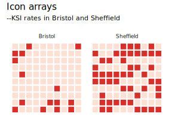
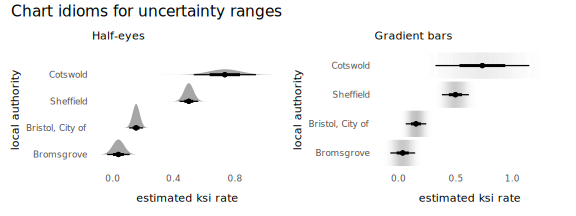
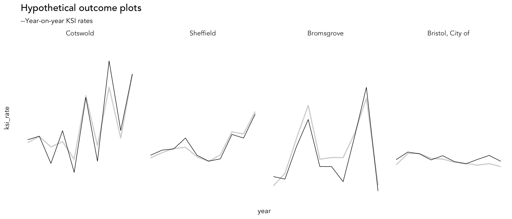

## Introduction

This document demonstrates how the uncertainty visualization techniques enumerated in Phase 3 of our framework (*P3. Infer + Check*) can be implemented. It does so via a slightly different analysis to that appearing in the paper. We compare how pedestrian injury *severity* rates -- the proportion of crashes that result in a fatality or serious injury (KSI) -- vary between local authority reporting areas.

Please cite:

Beecham, R. and Lovelace, R. _A framework for inserting visually-supported inferences into geographical analysis workflow: application to road crash analysis_. DOI: []().


## Setup

### Required libraries 

If you do not have them, the required packages can be installed individually with `install.packages(<package_name>)`. Core packages are imported into the session with `library(<package_name>)`. Occasional use of packages is made with the `<package-name>::<function-name>()` syntax so as to avoid polluting the workspace.


```{r, load-packages, eval=FALSE}
pkgs <- c("tidyverse","sf", "here", "rsample", "ggdist", "distributional", "gganimate")
# If not already installed.
# install.packages(pkgs)
# Core packages.
library(tidyverse)              # Bundle of packages for data manipulation. 
library(sf)                     # For working with geospatial data.
```


### ggplot themes and plot heper functions

I have created a `ggplot` theme for the plots in the paper and some additional short helper functions. Load these into the environment using the call to `source()` below.

```{r, set-themes, eval=FALSE}
# Load plot helper functions. 
source(here::here("R", "plot_helpers.R"))
```

## Download data

Load the pre-prepared crash data, described in [`data-processing.md`](data-processing.md). Additionally, 2019 Local Authority District (LAD) [boundary data](https://geoportal.statistics.gov.uk/datasets/local-authority-districts-december-2019-boundaries-uk-bgc/explore). I have placed these in the [`/data`](/data) folder.


```{r, download-data, eval=FALSE}
# Crash data.
ped_veh <- fst::read_fst(here::here("data", "ped_veh.fst"))

# LAD context. 
# Boundary data simplified using mapshapr (https://github.com/mbloch/mapshaper).
lad <- st_read(here::here("data", "lad.geojson")) 
```

## Frequency framing: icon arrays

Often in a data analysis, parameters of interest are represented as probabilities, or relative frequencies – ratios or percentages describing the probability of some event happening. It is notoriously difficult to develop intuition around these sorts of relative frequencies. In the STATS19 dataset, we may wish to compare the injury severity rates  between two local authority areas, say Bristol and Sheffield. There is in fact quite a difference in the injury severity rate between these two local authority areas in 2019: 15% for Bristol (35 out of 228 reported crashes were KSI) versus 50% for Sheffield (124 out of 248 reported crashes were KSI).

This feels like quite a large difference, but it is difficult to imagine or experience these differences in probabilities when written down or encoded visually using say bar length. Icon arrays are used extensively in health communication and have been demonstrated to be effective at communicating probabilities of event outcomes ([nice application to electoral polling](https://www.washingtonpost.com/news/monkey-cage/wp/2016/11/29/how-to-better-communicate-election-forecasts-in-one-simple-chart/?noredirect=on)). They offload the thinking that happens when comparing ratios -- the internal weighing up of numerators and denominators. In the example below, icon arrays are used to compare the two injury severity rates for Bristol and Sheffield. Imagine that 100 crashes were sampled from both cities and each sampled crash encoded as a square and coloured according to whether it resulted in a serious injury or fatality (KSI, dark red) or slight injury (light red).



In the code below we first generate an array of cell locations and allocate `boolean` values randomly to the cell locations in the same proportions that KSIs occur in each local authority.

```{r array-data, echo=TRUE, eval=FALSE, message=FALSE}
array_data <- tibble(
  row=rep(1:10, times=1, each=10),
  col=rep(1:10, times=10, each=1),
  Sheffield=
    sample(
    c(rep(TRUE, times=1, each=50), rep(FALSE, times=1, each=50)),
    size=100, replace=FALSE),
  Bristol=
    sample(
    c(rep(TRUE, times=1, each=15), rep(FALSE, times=1, each=85)),
    size=100, replace=FALSE)
)
```

These data are plotted usng the `geom_tile()` mark, as below.

```{r plot-array, echo=TRUE, eval=FALSE, message=FALSE}
array_data %>%
  pivot_longer(cols=c(Sheffield,Bristol), names_to="la", values_to="is_ksi") %>%
  ggplot(aes(x=row,y=col, fill=is_ksi)) +
  geom_tile(colour="#ffffff", size=1) +
  scale_fill_manual(values=c("#fee0d2","#de2d26"), guide=FALSE)+
  facet_wrap(~la)+
  theme_paper()+
  theme(axis.text=element_blank(), axis.title.x=element_blank(), axis.title.y=element_blank())+
  coord_equal()
```

## Uncertainty quantification: bootstrapping

In the icon arrays above I made little of the fact that the sample size varies between the two recorded crash rates. Partly this was because the differences were reasonably small. When looking at injury severity rates across all local authorities, however, there is substantial variation in the rates and sample sizes. Bromsgrove has a very low injury severity rate based on a small sample size (4%, or one out of 27 crashes resulting in KSI); Cotswold has a very high injury severity rate based on a small sample size (75%, or 14 out of 19 crashes resulting in KSI). With some prior knowledge of these areas, one might expect the difference in KSI rates to be in this direction, but would we expect the difference to be of this order of magnitude? Just eight more KSIs recorded in Bromsgrove makes its KSI rate equivalent to that of Bristol’s. 

Although STATS19 is a population dataset to the extent that it contains data on every crash recorded by the Police, it makes sense that the more data on which our KSI rates are based, the more certainty we have in them being reliable estimates of injury severity. So we want a way of expressing this uncertainty and making it intrinsic to any comparisons that are made. We regard our observed data as a sample of an (unobtainable) population and calculated KSI rates as parameters that try to represent, or estimate, this population. From here we can apply some statistical concepts to quantify uncertainty around the calculated KSI rates: that a sampling distribution can be derived and used to quantify the precision of each KSI rate estimate. This sampling distribution is generated empirically below via a non-parametric bootstrap consisting of 1000 resamples with replacement. Upper and lower limits are lifted from .025 and .975 percentile positions of the bootstrap sampling distribution.

Below is code to generate this sampling distribution. [`purrr`](https://purrr.tidyverse.org/) makes it very easy to generate re-usable templates for generating and organising bootstraps.

```{r rate-bootstrap, echo=TRUE, eval=FALSE, message=FALSE}
rate_boots <- ped_veh %>%
    mutate(
      is_ksi=accident_severity!="Slight",
      year=lubridate::year(date)
    ) %>%
    filter(year==2019) %>%
    # Select out LAD code and is_ksi as no other crash context required.
    select(local_authority_district, is_ksi) %>%
    # Nesting to collapse data to a list-col.
    nest(data=c(local_authority_district, is_ksi)) %>%
    # Resample observations from this data frame with replacement, keep original data.
    mutate(la_boot=map(data, rsample::bootstraps, times=100, apparent=TRUE)) %>%
    select(-data) %>%
    # Unnest to generate data frame of bootstrap IDs and associated data, stored in splits.
    unnest(la_boot) %>%
    # Map over splits and extract LAD code.
    mutate(
      lad=map(splits, ~rsample::analysis(.) %>% pull(local_authority_district)),
      is_ksi=map(splits, ~ rsample::analysis(.) %>% pull(is_ksi))
    ) %>%
    # Unnest to data frame where each observation is a bootstrap ID and sampled LAD.
    select(-splits) %>% unnest(c(lad,is_ksi)) %>% ungroup %>% 
  filter(lad %in% c("Bristol, City of", "Sheffield", "Bromsgrove", "Cotswold")) %>% 
  # Calculate ksi rates for resamples.
  group_by(lad, id) %>% 
  summarise(
    ksi_rate= mean(is_ksi),
    sample_size=n()
  )  
```

## Uncertainty representation: gradients/half-eyes

Typically the ranges computed above might be represented as error bars. There are problems with such a representation -- the hard borders of the error bars can lead to unhelpful binary/dichotomous thinking (e.g. [Correll and Gleicher 2014](https://ieeexplore.ieee.org/document/6875915)). Certain values within the empirical bootstrap distribution are more probable than others and so we should endeavour to use a visual encoding that reflects this. Matt Kay’s excellent [`ggdist`](https://mjskay.github.io/ggdist/) package extends `ggplot2` with a collection of chart idioms for representing these sorts of intervals. 

Below are half eye plots and gradient bars, implemented using `ggdist`, which give greater visual saliency to parameter estimates that are more likely.



```{r plot-bootstrap, echo=TRUE, eval=FALSE, message=FALSE}
rate_boots %>%
  group_by(lad) %>%
  # Calculate ranges.
  mutate(
    std.error=sd(ksi_rate), 
    lower=quantile(ksi_rate,probs=.025), 
    upper=quantile(ksi_rate,probs=.975)
    ) %>%
  filter(id=="Apparent") %>%
  ggplot(aes(x=reorder(lad, ksi_rate), y=ksi_rate)) +
  stat_dist_halfeye(
    aes(dist = dist_normal(mu = ksi_rate, sigma = std.error)),
    point_size = 1.5) +
  labs(y="estimated ksi rate", x="local authority", subtitle="Half-eyes")+
  coord_flip()
```


## Uncertainty representation: HOPs

Since STATS19 is released annuallyit is instructive to explore the stability of local authority KSI rates year-on-year. Below we represent KSI rates from the full dataset using a thick line and to help communicate stability in the year-on-year changes, we animate over lines produced from bootrstrap resamples of the year-on-year data. These sorts of Hypothetical Outcome Plots have been demonstrated to be effective at uncertainty represetation,  giving analysts a more "visceral" experience of volatility and range in possible outcomes (see [Kale and Hullman 2018](https://medium.com/@uwdata/hypothetical-outcome-plots-hops-help-users-separate-signal-from-noise-870d4e2b75d7)). They are again straightforward to implement in `ggplot2` with [`gganimate`](https://gganimate.com/).




```{r rate-bootstrap-temporal, echo=TRUE, eval=FALSE, message=FALSE}
# Update bootstrap template, nesting by year.
rate_boots_temporal <- ped_veh %>%
    mutate(
      is_ksi=accident_severity!="Slight",
      year=lubridate::year(date)
    ) %>%
    # Select out LAD code and is_ksi as no other crash context required.
    select(local_authority_district, is_ksi, year) %>%
    # Nesting to collapse data to a list-col.
    nest(data=c(local_authority_district, is_ksi, year)) %>%
    # Resample observations from this data frame with replacement, keep original data.
    mutate(la_boot=map(data, rsample::bootstraps, times=50, apparent=TRUE)) %>%
    select(-data) %>%
    # Unnest to generate data frame of bootstrap IDs and associated data, stored in splits.
    unnest(la_boot) %>%
    # Map over splits and extract LAD code.
    mutate(
      lad=map(splits, ~rsample::analysis(.) %>% pull(local_authority_district)),
      is_ksi=map(splits, ~ rsample::analysis(.) %>% pull(is_ksi)),
      year=map(splits, ~ rsample::analysis(.) %>% pull(year))
    ) %>%
    # Unnest to data frame where each observation is a bootstrap ID and sampled LAD.
    select(-splits) %>% unnest(c(lad,is_ksi, year)) %>% ungroup %>% 
  filter(lad %in% c("Bristol, City of", "Sheffield", "Bromsgrove", "Cotswold")) %>% 
  # Calculate ksi rates for resamples.
  group_by(lad, id, year) %>% 
  summarise(
    ksi_rate= mean(is_ksi),
    sample_size=n()
  )  

# Animate over bootstrap resamples using gganimate::transition_states().
hop <- rate_boots_temporal %>% ungroup() %>% 
  mutate(
    year=as.character(year),
    lad=factor(
      lad, levels=c("Cotswold", "Sheffield", "Bromsgrove", "Bristol, City of")
    )
  ) %>%
  ggplot(aes(x=year, y=ksi_rate)) +
  geom_line(
    data=. %>% filter(id!="Apparent"), aes(group=id), size=.3
  ) +
  geom_line(
    data=. %>% filter(id=="Apparent") %>% mutate(id_apparent=id) %>% select(-id), aes(group=id_apparent), size=.7, alpha=.2
  ) +
  facet_wrap(~lad, nrow=1) +
  theme(
    axis.text.x=element_blank(), axis.text.y=element_blank()
  ) +
  gganimate::transition_states(id, 0,1)+
  labs(
    title="Hypothetical outcome plots",
    subtitle="--Year-on-year KSI rates")
```

